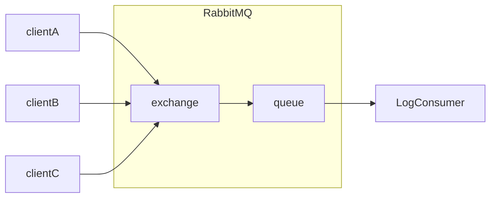

# rabbitmq-logging

A Python logging handler and formatter for RabbitMQ.

- minimal impact on your existing codes
- centralized logging
- support pika and HTTP handler
- could be customized on demand

# Diagram



# How to use?

1. install RabbitMQ (by using docker)

```shell
docker run -it --rm --name rabbitmq -p 5672:5672 -p 15672:15672 rabbitmq:3.9-management 
```

2. log something in your code, as before.

```python
import logging

from rabbitmq_logging.adapter import RabbitMQLoggingExtra
from rabbitmq_logging.formatter import RabbitMQLoggingDefaultFormatter
from rabbitmq_logging.handler.rabbitmq_handler.rabbitmq_pika_handler import RabbitMQPikaHandler

# get logger
logger = logging.getLogger('hello.world')

# add rabbitmq handler, and set formatter
handler = RabbitMQPikaHandler()
handler.setFormatter(RabbitMQLoggingDefaultFormatter())
logger.addHandler(handler)

# add extra info by Adapter
logger = logging.LoggerAdapter(logger, RabbitMQLoggingExtra)

# start using logger!
logger.warning('first logging to rabbitMQ')
```

3. write your own log consumer to process logs. The message will looks like:

```text
2022-05-06 14:47:18,062 - ERROR - hello.world - andyguo - 192.168.0.108 - example.py - 17 : first logging to rabbitMQ
```

# Config

All info needed are packaged into a `RabbitMQSettings` object, inherent from `pydantic.BaseSettings`. See more
from [pydantic docs](https://pydantic-docs.helpmanual.io/usage/settings/).

# Performance

It's not been benchmarked. However, from Offical HTTP API doc, `RabbitMQHTTPHandler` is not recommended for
high-throughput scenario.
> Please note that the HTTP API is not ideal for high performance publishing; the need to create a new TCP connection for each message published can limit message throughput compared to AMQP or other protocols using long-lived connections.